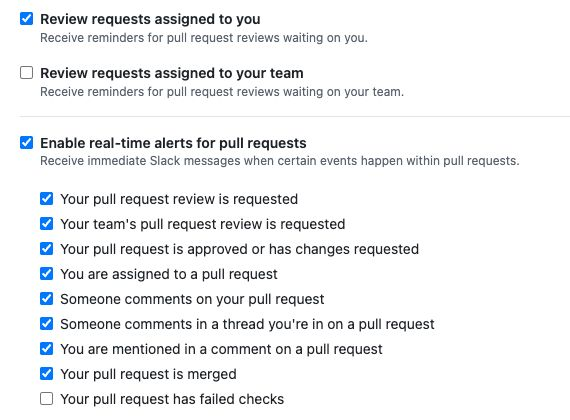
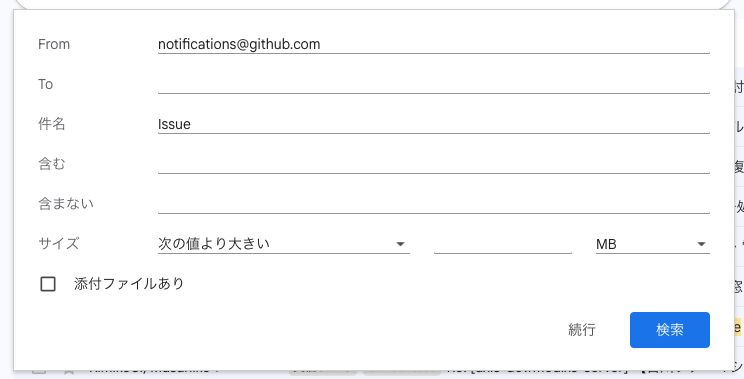
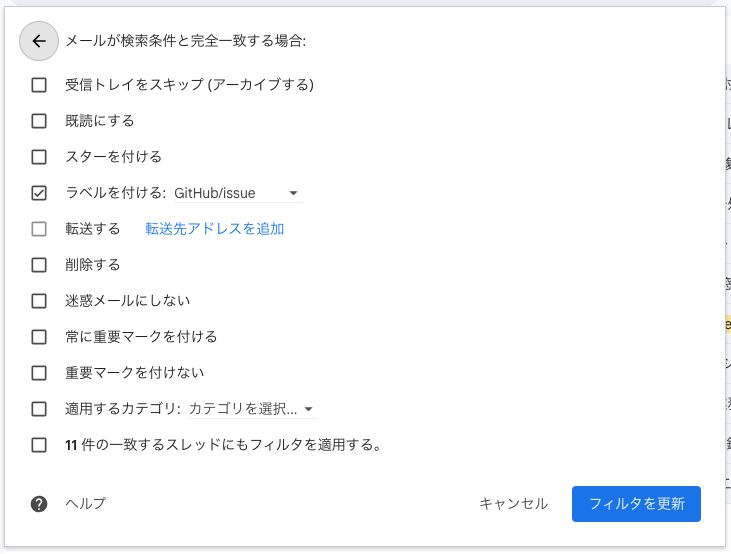
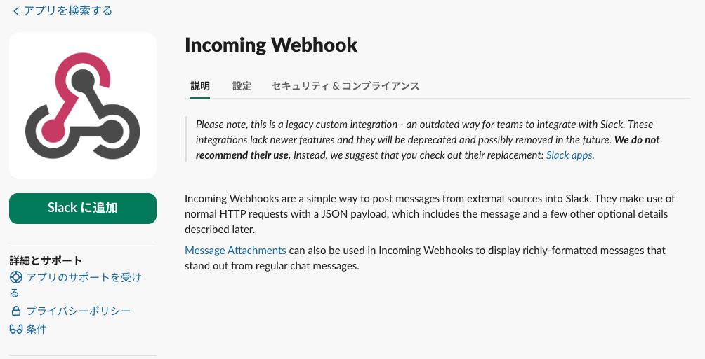

GitHubをSlack通知してる人は多いと思いますが、issueはできないので困る  
repository全体の話ではなく、GitHubが個別に通知してくれる系のやつの話

Scheduled reminderで設定する↓このへんのやつら  

これを無理やり？Slack通知させるようにしたのでそれについて書いていく  
（こんなことせずとも通知されるのであれば教えて欲しい、、、）

## Gmailの設定

Slack通知はできなくても、おそらくメール通知は来ていると思う  
そして多くの方はGmailを使っていると思う  
今回はGmailのラベルを使う

まずは検索窓に表示されている「検索オプションを表示」からを開く  
そこで以下の設定をする

From: notifications@github.com  
件名: Issue

その状態で続行をクリックして以下のような設定をする

細かい部分は好き好きに設定してもらって良いが、とりあえずラベルをつけるようにする  
で、右下の「フィルタを更新」（初めてであれば更新じゃないと思う）をクリックする

これでGmailの設定はOK

## 通知先のSlackチャンネルを作成する

まずは好きにチャンネルを作成する  
作成したチャンネル名を右クリックして、チャンネルの詳細を開く  
インテグレーションタブを開き、「アプリを追加する」をクリックする  
「Incoming Webhooks」を追加する

Slackに追加をクリックし諸々設定すると、Webhook URLが表示されるのでコピーしておく

## GASを使ってSlackに通知させる

[Google Apps Script](https://script.google.com/home)を開く  
新しいプロジェクトを作成し、エディタを開く

https://github.com/keisuke-yamauch1/gmail-to-slack-gas/blob/main/gas.js  
こちら内容を貼り付ける

左側のメニューから設定を開き、スクリプトプロパティを追加する  
SLACK_WEBHOOK_URL: Slack作成時のWebhook URL  
GITHUB_ORG: GitHubのユーザー名か組織名

左側のメニューのトリガーで任意の設定をする

これでGitHub/issueというラベルのついたメールが来たらSlackに通知される

### スクリプトを簡単に説明
件名、送信者、本文、関連リンクが通知される  
内容は好きに改変してもらえればと思う

関連リンクについては、メールに表示される以下のような部分を取得している

XXX さんがコメントを残しました(`{組織名}/{リポジトリ名}#{issue番号}`)  

この()内がissueコメントへのリンクになっているので、これを表示している

Slackの通知で内容がざっくりわかる、issueへのリンクがある  
このあたりを満たせればなんでも良かったので、改善の余地は色々あるかもしれない

### 検証方法
Gmailの何かしらのissueのメールにGitHub/issueのラベルをつけて、未読にした状態でGASを実行すると、検証ができる

---

以上

どうにかしようと思って、Geminiに聞きつつ作った勢いでそのまま記事を書いたので、まだ運用していない汗  
なので本当に期待通りになるかは不明だが、まあどうにかなるだろう、、、
