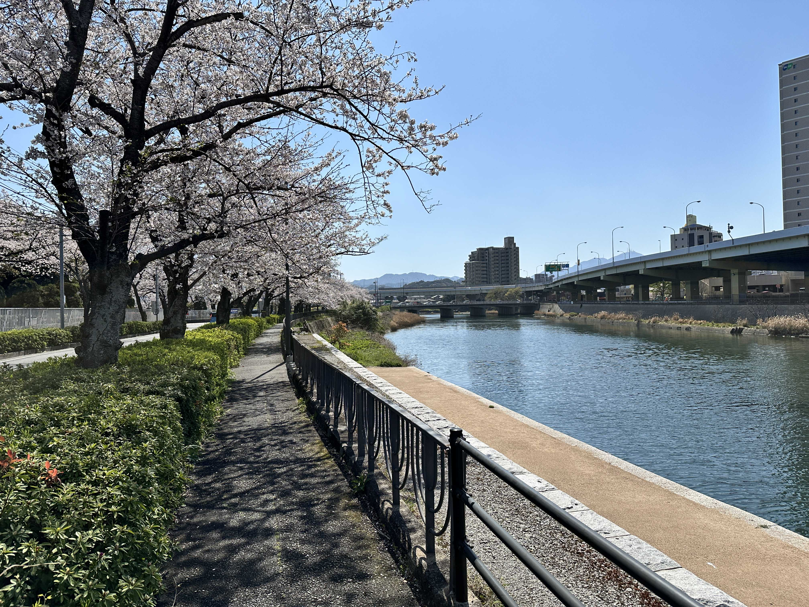
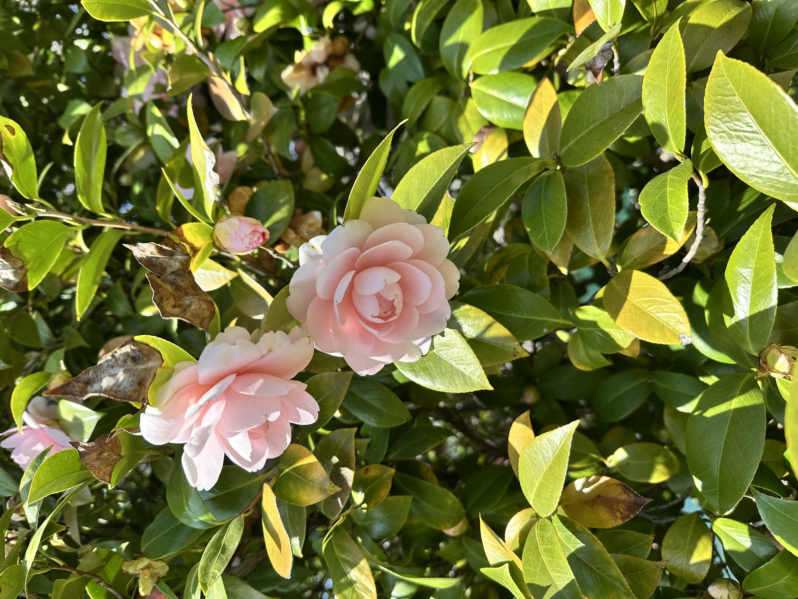

今日は昼から妻と紫川沿の桜が咲いている歩道を散歩した。  
散歩というよりは花見メイン。  
天気も良く花見日和だった。  

  
椿の花も綺麗に咲いていて、非常に良い。  

こういう、季節を感じるようなイベント（花見とか）は結構好きだったりもする。  
  
それはそうと、ここ最近はmoNa2が欲しくて欲しくて、毎日boothを眺めている。  
[https://booth.pm/ja/items/6376654](https://booth.pm/ja/items/6376654)  
今はkeyball44を使用しているが、これを職場に持ってったり持って帰ったりするのが結構めんどーなんだよね。  
なのでmoNa2を検討している。  
中々在庫が入荷されない＆入荷されても激戦区という苦しみがある。。。  
次の入荷で買えますように、、、  
  