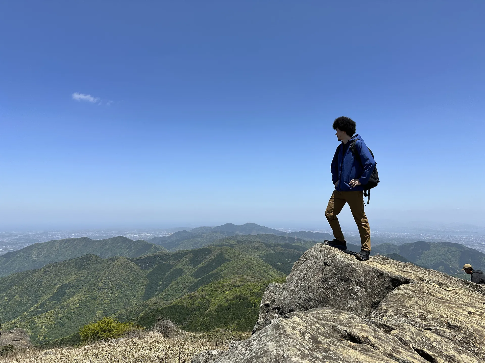

3回目の家族登山！  
福岡県の福智山に登ってきた

wikipedia曰く

> 福智山は福岡県北部に位置する山で、北九州市、直方市、福智町の最高峰である。九州百名山のひとつに数えられ、福智山周辺は平尾台や皿倉山同様に北九州国定公園に含まれている。

らしい

登ったのはこのコース  
https://yamap.com/model-courses/11541

次男がヘロヘロになっていた  
てか、山登る前の道路歩いてる時点でヘロヘロだった  
なんでや

思ったほど疲れなかったけど、登頂した時点で尿意があり、爆速下山する羽目になったので下山は結構疲れた  
登山の時は割とガチで紙オムツとか履くのもありなのかもしれない、、、

こんなレポートがあるくらいだ  
https://yamap.com/activities/2813166

かれこれここ半年弱で3回登山に行ってるし、今後も行くだろうということでトレッキングポール（山登り用の杖）をポチってみた  
届き次第、近所の山（足立山かなー）あたりを登ってみようと思ってる

