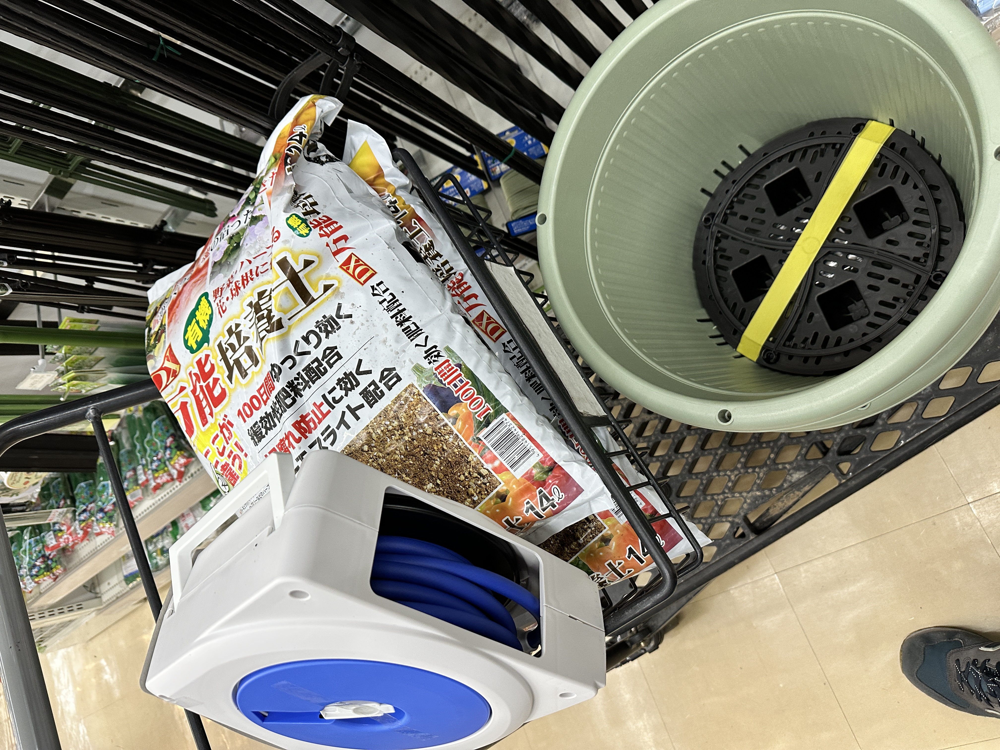

今日は、お昼に北九州にある二郎系のラーメンを食べた。  

今を楽しめというお店  
https://g.co/kgs/VJ9N4G5

このお店に行くのは2回目で、前回はどんなもんかわからなかったので（量的な意味で）控えめに頼んだら、少し物足りなかったので今回は少し多めに頼んだ。
- 麺200g
- ニンニク マシ
- ヤサイ マシ
- アブラ マシ
- カラメ マシ

ちなみに前回はこんな感じ（記憶が曖昧、、、）
- 麺100g
- ニンニク あり
- ヤサイ あり
- アブラ 少なめ
- カラメ あり

結果、後半しんどかったw  
このラーメンを食べながら飲む水がマジで美味かった

---

その後はグッデイに買い物に行った。  
アイスを買ってもらう約束を取り付けた上で。  
（ちなみに我が家は数年前に車を手放したので、timesのカーシェアを使っている。おすすめ）

こんなものを買って、  

こうなった（写真は一部だけど）  
  
1枚目はゴーヤで、2枚目はキュウリ。  
グリーンカーテンにすべく、ネットを貼った（張った？）。  
ちなみにネットはダイソーに行って買った。

給水用にホースも買ったので、水やりUXが爆上がりした。  
ゴーヤチャンプルが待ち遠しい。

ちなみに、**アイスはまだ買ってもらっていない**。
