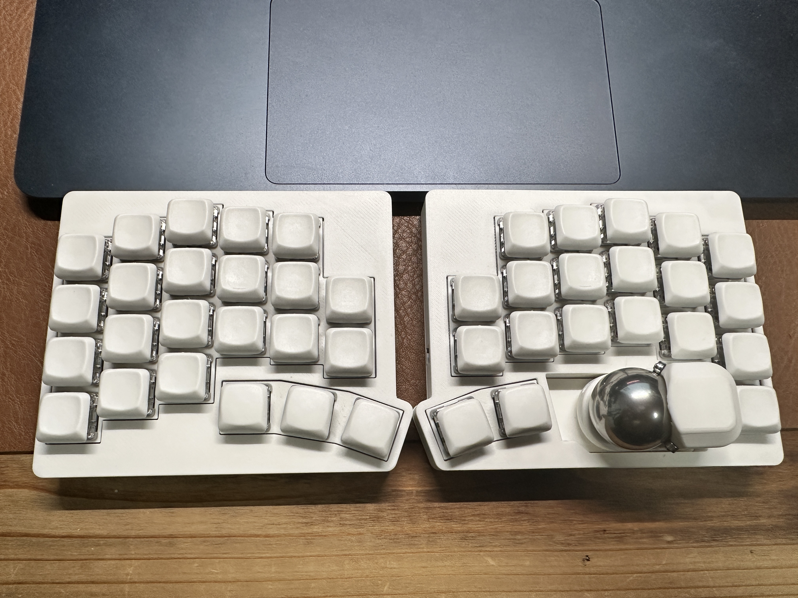
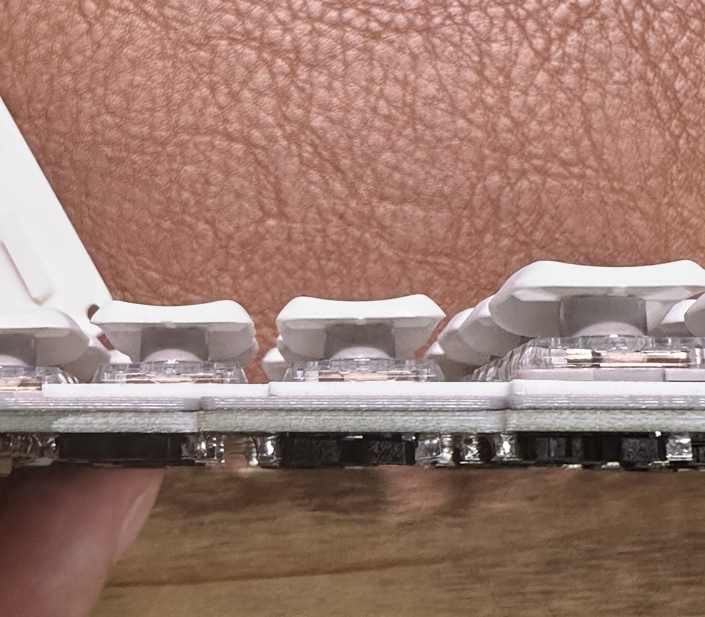
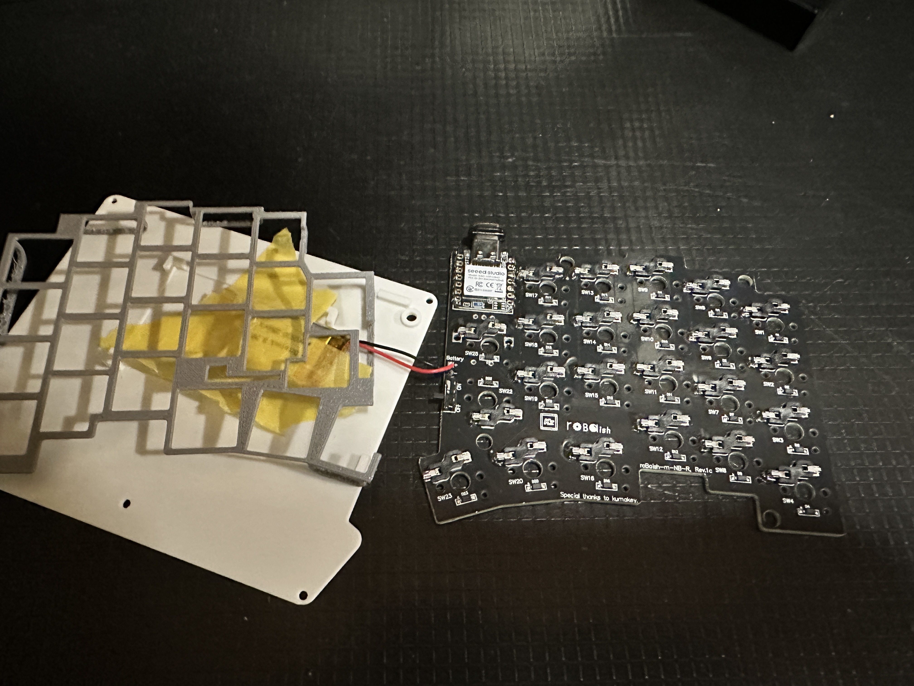
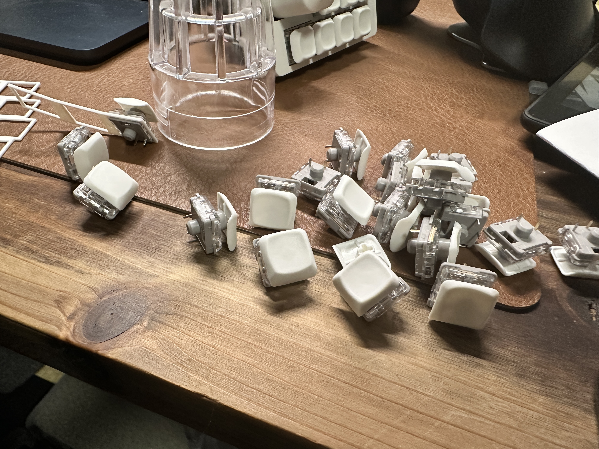
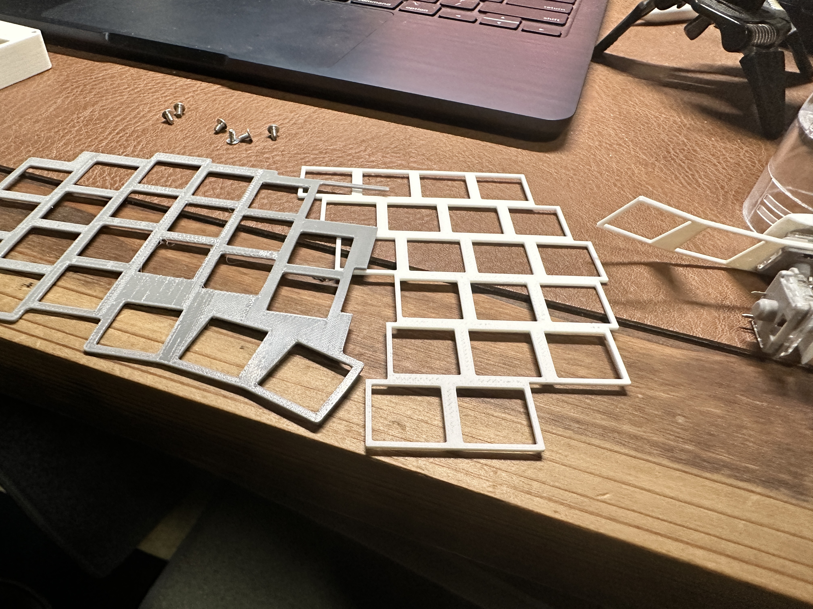

import { Tweet } from 'astro-embed';

4月にメルカリで買ったキーボードの、Rのキーがチャタリングするなーと思い続けてた。キースイッチを入れ替えたら一瞬よくなって、よし、と思ったけどまたすぐチャタリングが発生し出した。

こんなキーボード。買った時から少し様子は変わっている。  
  

いい加減そろそろ（土曜日だし）改善するかーと思って、分解してみたところ  

  

わかるだろうか。真ん中の黒いやつがちょっと浮いている。  
これが浮いてるせいで、キースイッチとこいつの接触が悪くてチャタリングしてるんだろうとアタリをつけて作業をした。

で、出た〜〜〜！作業後写真撮忘奴〜〜〜〜！！

ということで作業後の写真は撮り忘れたので、代わりにパーツたちの写真を、、、  

半日程度使ってみて、今のところチャタリングは発生していないので、なおったんだと思う。  
よかったよかった。

この作業でちょっとした事件？があって、ハンダゴテが壊れてしまって悲しい。
まあ、安物なのが幸い。

---

今年、会社の同僚とISUCON出るぞ！という話をしていて、awsに環境を作るためにawsの整理をした。毎月160JPYくらい掛かってるまま放置してたのを消すなどをした。

これまではdocker composeでやってたので、これからはawsでやってくぞー！  
ほっとくとボチボチ課金が発生するイメージがあるので、ec2のインスタンスを停止し忘れないようにしないとな  
なんか仕組み化した方がいいだろうか

---

「めんどくせーなー」って言いながらも手を動くかー、なるほどな
<Tweet id="https://x.com/super_bonochin/status/1926100853892530473?s=46&t=_6WX1ix69--VKzzZgcvAzQ" />

