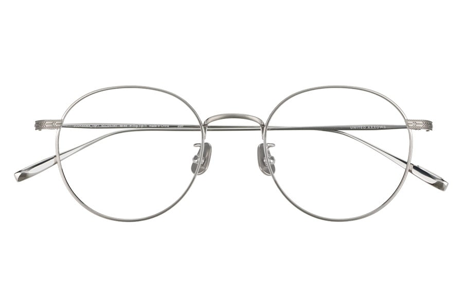
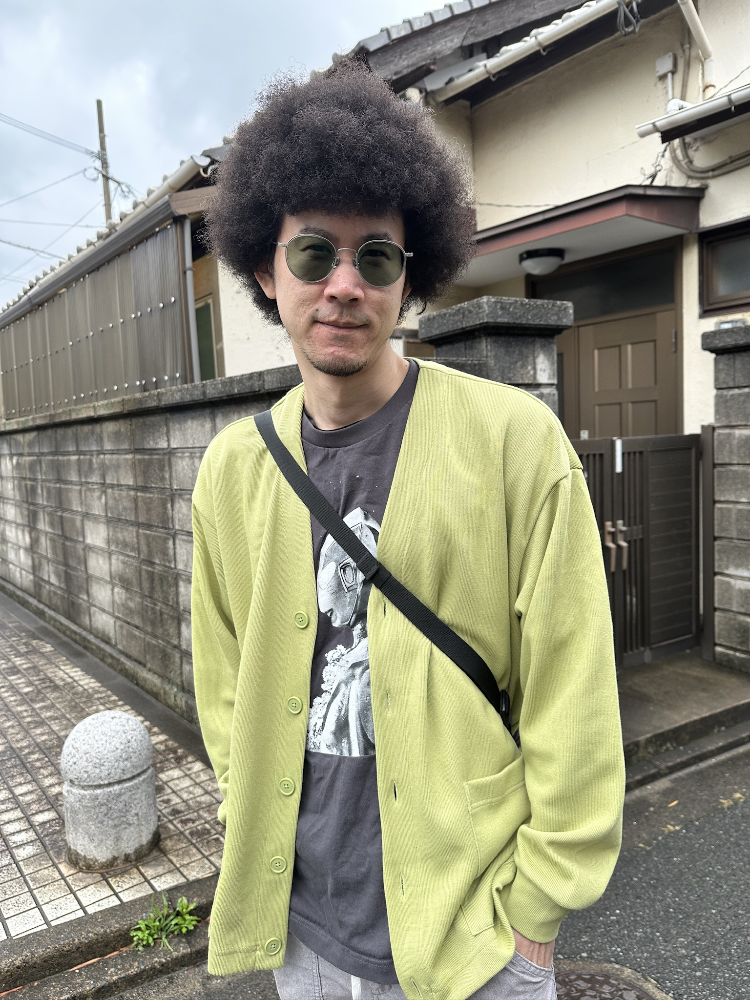
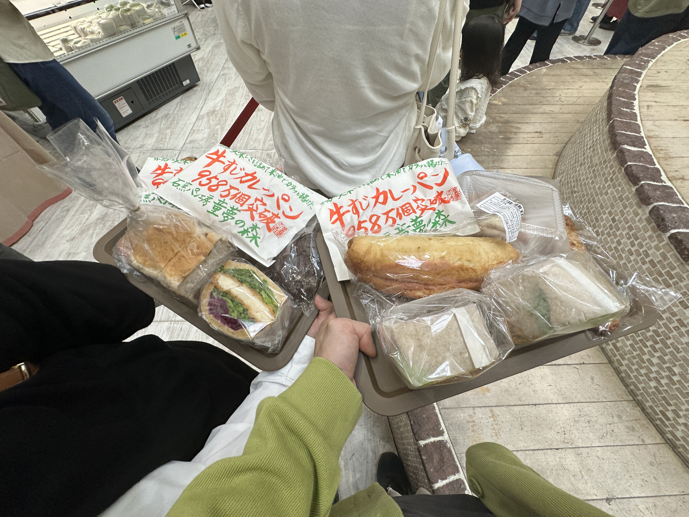

import { YouTube } from 'astro-embed';

zoffの調光レンズ（とメガネ）を買ったぜー！

このメガネに [Zoff｜UNITED ARROWSZO243006-15F1](https://www.zoff.co.jp/shop/g/gZO243006-15F1/)  

グリーンの調光レンズを入れた  
https://www.zoff.co.jp/shop/help/lensguide_2waylens.aspx

34歳にして、グラサンデビューやでー  
セレブの仲間入りやでー

普段はこうで  

色が変わるとこうなるでー  

オシャやでー

妻も一緒にメガネを買った。会社から30％引きのクーポン貰ってたから、強気の選択をした。

---

zoffの入っている建物で、パン市みたいなのをやってて妻が気になってるらしいパン屋も出店してたから行ってみた。

写真はカレーパンの主張が激しいが、色々買った。  

12時から開始で、11時50分くらいに行ったらすでに500人くらい（ぶっちゃけテキトーだけど、それくらいはいた気がする）並んでて、1時間ちょい並んでやっと市場内に入れた。お目当ては買えずだった。

それと、個人的にはその辺の街のパン屋さんで買っても同じくらい美味しいパンがあると思った😅  
少なくとも1時間並んで買う必要はなかったなーという感想😅  
まあ買って食べてみないことにはわからないからね。

---

この動画を見てたら懐かしくて震えた  
<YouTube id="eJgBMv_hqqc" playlabel="Play" />
