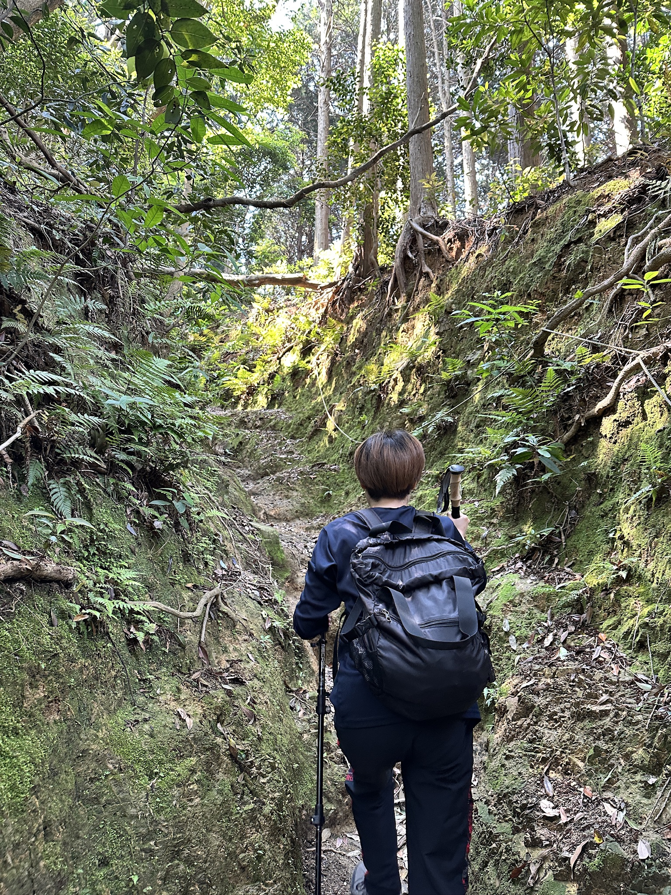
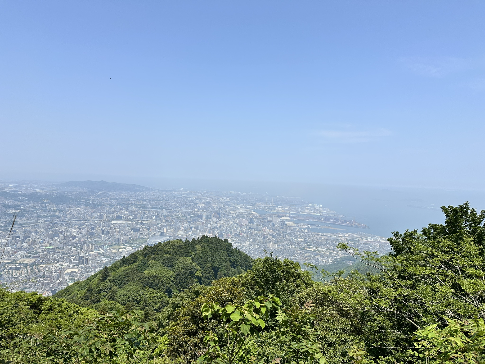
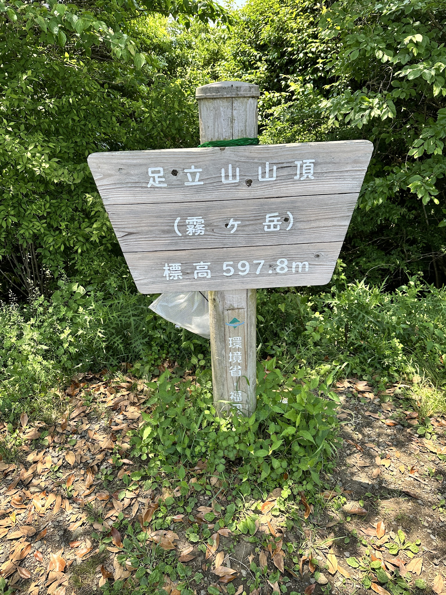
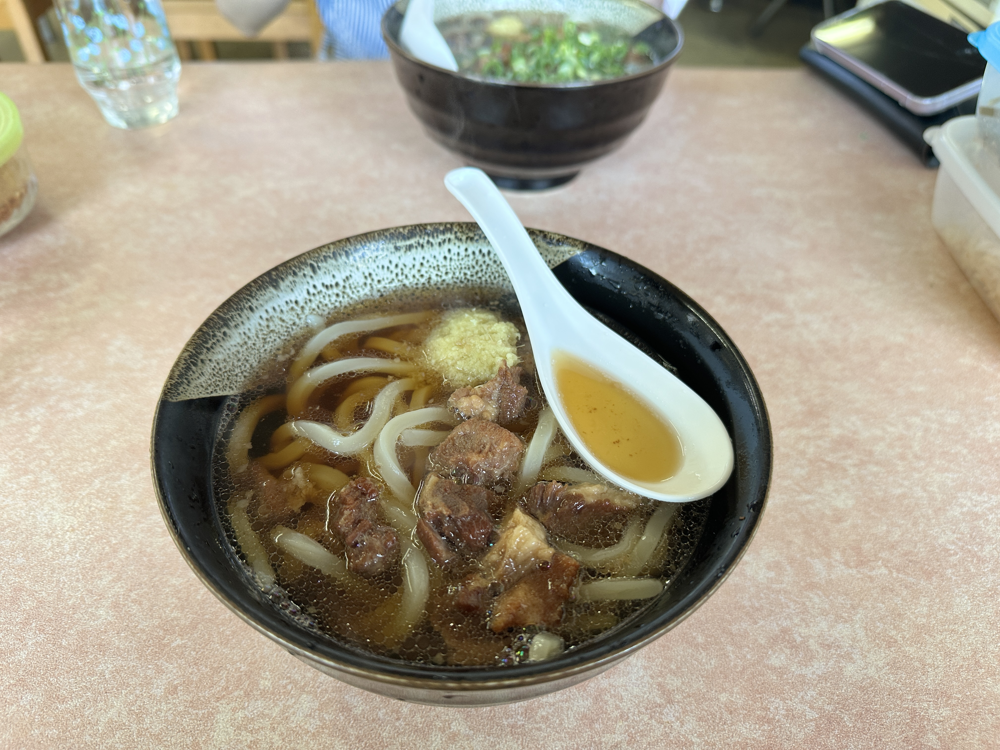
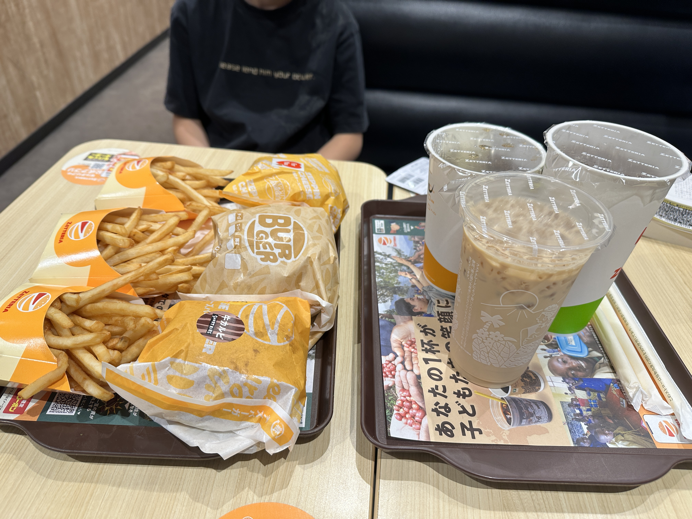
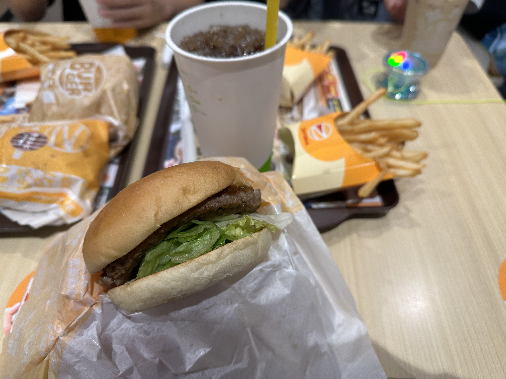

今日は朝イチで妻と登山に行った🗻  
[妙見山登山口-足立山 往復コースの地図・登山ルート・登山口情報 | YAMAP / ヤマップ](https://yamap.com/model-courses/1167)

上りの道  （と妻の背中）  

途中で見た景色  

頂上の看板  

トレッキングポール（山登り用の杖）を買って初めての登山だったのでワクワクしながら登った  
それなりに疲労は軽減できた気がするけど、そもそも楽な山だった可能性も高い  
今後も使っていってみよう  
安物だから不安だったけど、初心者には問題ない感じだった

---

お昼は家の近くのドキドキ（肉肉）うどんを食べた  
ちょいちょい行っているお店  
[福ちゃんうどん - 北方/うどん | 食べログ](https://tabelog.com/fukuoka/A4004/A400502/40031673/)

---

夕食はゼッテリアに行った  
長男は「いや、いい」と言うことで来なかった  
なかなか家族で出かける時についてこない日が増えている  

---

ブログに貼るURL取得用に、これを入れた  
[Copy Title and Url as Markdown Style - Chrome ウェブストア](https://chromewebstore.google.com/detail/copy-title-and-url-as-mar/fpmbiocnfbjpajgeaicmnjnnokmkehil?hl=ja)

---

なんか面白そうな、この本をポチった（unlimited）  
呪いを、科学する (ディスカヴァー携書) eBook : 中川朝子  
https://www.amazon.co.jp/dp/B0B49C9X67

---

画像の名前を変えたいが、めんどーだな  
ちまちまやっていくかー
