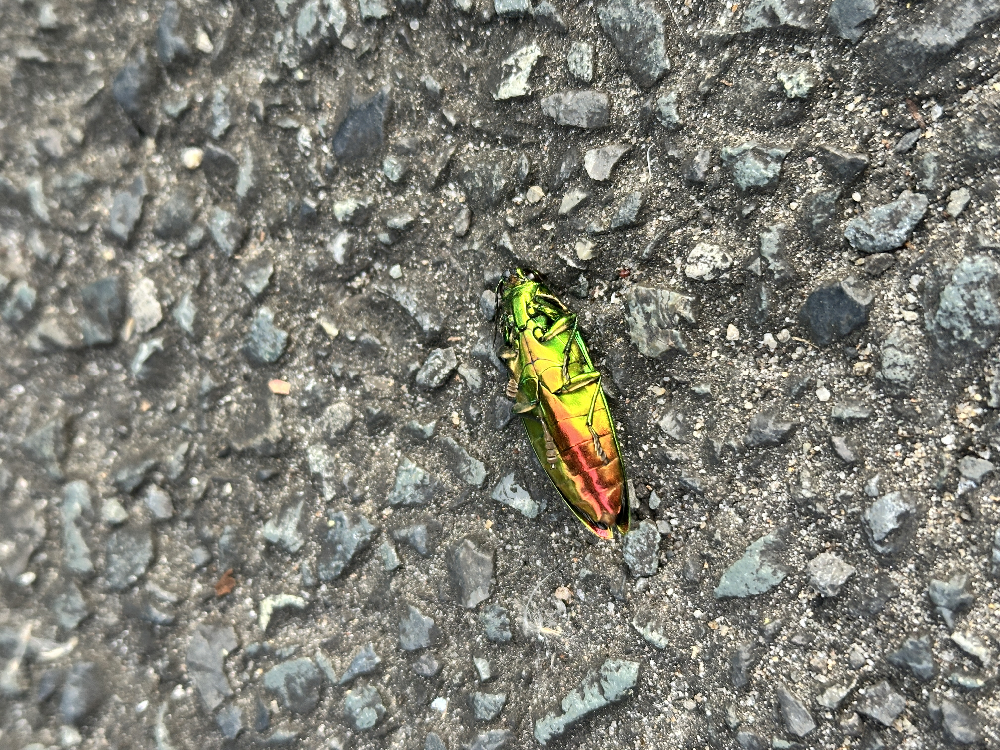
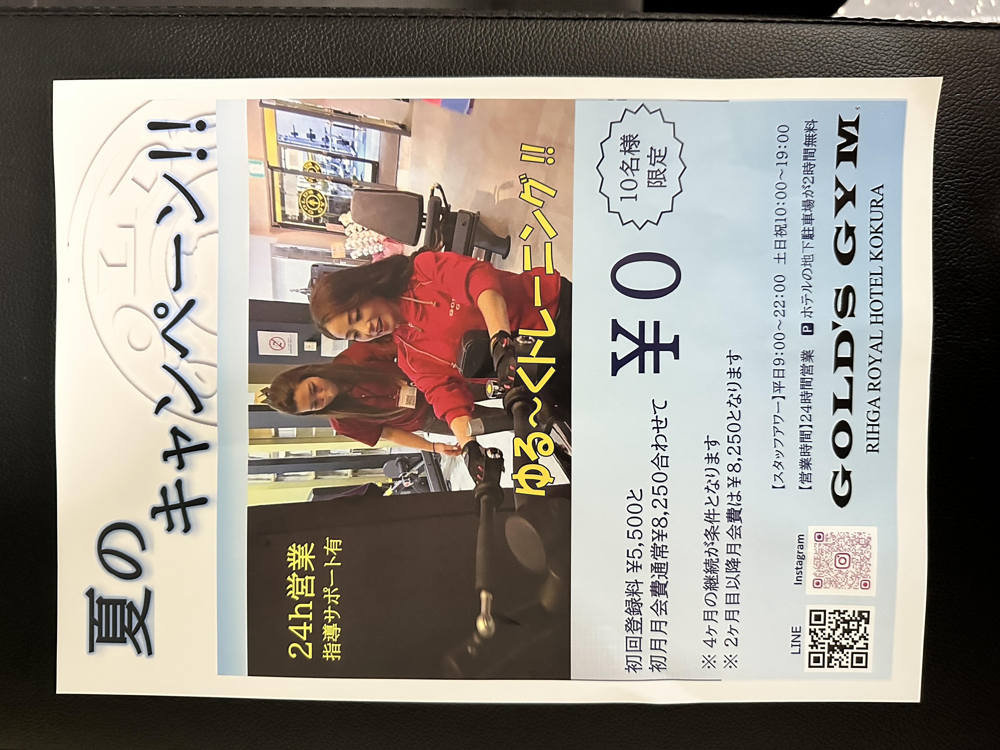

息子と道をテクテク歩いてたら謎の物体を発見した

この写真の距離感だと虫だとわかるけど、遠目に見ると謎に輝く物体だった  
んで、ひっくり返して見ると

お、タマムシやんけ！ってなった  
初めてタマムシ見たなー  
死んでるのかなと思ったけど、生きてはいるみたいだった  
ただ、かなり弱ってはいそうだった

すげー、ギラついてたな

---

我が家で育てているゴーヤ  
窓に吸盤のフックを使ってネットを吊るしてたけど、重さで吸盤が外れてしまったっぽい

とりあえず応急処置だけして、明日もう少し頑丈な作りにする予定

---

ポストにゴールドジムのチラシが入ってた

なんか、失礼ながらめちゃ安っぽいチラシすぎて、ゴールドジムのパチモンかと思ったけど、どうやら本物らしい  
ただ、フランチャイズの店舗ではあった  
こういうのは本部は特に関与してない感じなのかな？

ただ、内容には非常に惹かれているので申し込む可能性がそこそこある

---

金曜日の話だけど、チームでやってる勉強会がとうとう全体の勉強会に格上げされた  
[チームの勉強会、こんなはずじゃなかったのに](/blog/5)

まあ実質的にはそんな感じだったから、とうとうそうなったかという感じ  
なのでこれまではチームで運営していたのが、各チームのリーダーが運営する形に変わった

チーム個別の何かを開催しないとな
