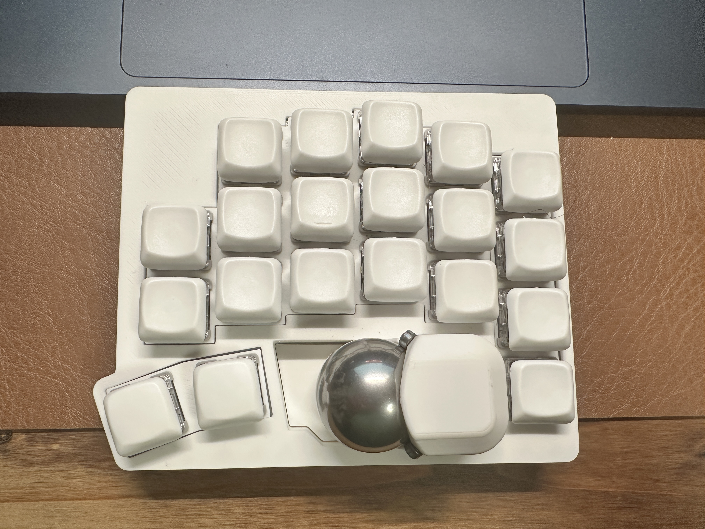

こんな分割キーボードを使っている

一般的なキーボードの「、」と「。」の位置に左クリックと右クリックを配置していた  
（この写真は右手側で、銀色の球はトラックボール）

そのクリックの際に、手の甲から手首あたりにかけて負荷が掛かっているのか、最近そのあたりが非常に熱を持っているのを感じる  
まだ痛みはないものの、日に日に熱い範囲が広がってきていて、そろそろまずいかもなーと思い元の設定に戻した  
元の設定だと、「J」が左クリックで「L」が右クリック

とりあえずこれでクリック時の負荷は軽減されるので、良くなっていくことを祈るばかり、、、

---

https://listen.style/p/yorisuna/lboqthyz  
このポッドキャストを聴いていて、生まれ変わるならと言う話が面白かった  
自分だったらなんだろうと考えると、何も考えず生きてそうなヤツがいいなと思った

ただ、1番の本音としては「別に生まれ変わりたいとかない」ではある
