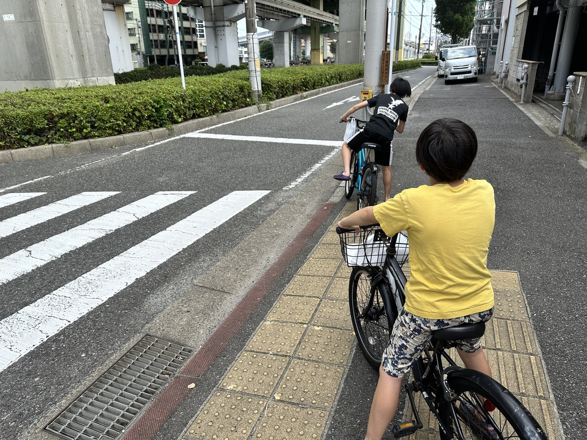
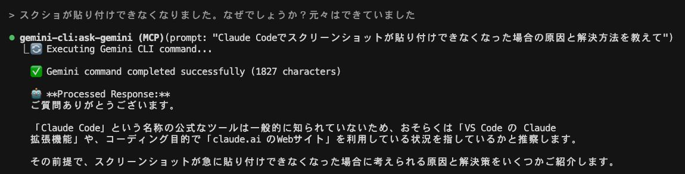

今日は午前中に、息子ふたりと一緒に自転車に乗って病院へ行った  
久々の自転車だったので、朝から空気を入れた  
暑ぅぅ・・・

病院と言っても大したことはなく？、つい最近息子たちが咳喘息と診断されて、その薬をもらいに行くための通院だった  
今は症状もなく落ち着いている

---

今日、Claude Code + Gemini CLIという組み合わせを使ってみた  
最初はできていたはずのスクショの貼り付け方がわからなくて、Claude Codeに尋ねると

- Claude CodeがGemini CLIにClaude Codeのことを聞く
- Gemini CLIはClaude Code？そんなもん知らん

というやり取りが行われてて、面白かった

ちなみにスクショの貼り付けは、`cmd + V`ではなく`ctrl + V`ということだった

---

7/11(金)に、全体の場に格上げされた勉強会でClaude Codeのtipsを話そうと思ってる  
会社としてClaude Codeが配布されて（これは親会社の施策の恩恵を受けている）使用する人が増えた  
僕はそれよりも先に使っていたので、tipsでも話すかーと思い立った

とはいえ使いこなしているわけでは全くないので、自分の勉強がてら色々触ってみてる  
カスタムコマンドとか、最近聞くHookとかも触ってみないとなー

最近はAI周りをチョコチョコ触っており、ISUCONの勉強を全然していない、、、

---

今日の読書とか勉強とか
- ８６―エイティシックス―Ep.4 ―アンダー・プレッシャー―
- Distinction2000
- Claude Codeのtipsとか
