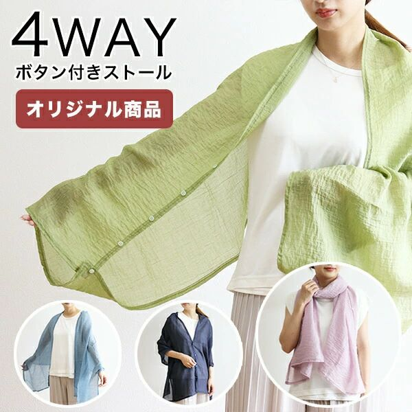

記事を読んだり、一言コメントを残したりしてて思うのは、スマホの方が記事は読みやすいけどそれにコメントするのであればPCの方がいい

スマホの場合は、画面あたりの文字量が少ないのと、スクロール体験がいい  
僕は文字の量が多いと全然読めないので、その点はスマホがいい  
スクロール体験は言わずもがな

PCは画面が大きい分、どうしても文字量が多くなる  
スクロールもマウスホイールとかを使ってスクロールしなきゃいけないので、スマホと比較すればめんどー  
スクロールめんどー問題は、トラックボール付きのキーボードを使っているのも関係しているかもしれない

文字入力に関しては、スマホとPCでは天と地ほどの差がある（個人の感想です  
文字の入力しやすさもそうだし、何か引用（コピペ）したいときとかもそう

---

数週間前、ちゃんと寝るようにしていたので、朝の7時に勝手に目が覚めるようになっていた  
よしよしキタぜ、とか思ってたけど今週1週間はどうやら元に戻ってしまったらしい  
ちゃんと寝ないとなぁ、睡眠不足はパフォーマンスに影響がある

---

業務スーパーに買い物に行ったんだけど、水菜がめちゃ安かった

しっかりと2点買わせていただいた  
少し前まで200円してて、ここ最近100円を見かけるようになったけど、さすがに39円は安すぎる

---

4月くらいに北九州にバーガーキングができたので、そろそろ行くかーと思って行ってみたら、まだまだ混んでいた  
そこそこ並ばないといけなさそうだったので、「まあ、そこまではいいかな」と思って諦めた

同じ施設内にフレッシュネスバーガーがあるので、そちらに行った  
黒毛和牛のハンバーガーがあったのでそれを食べたけど、「そうそう、これがハンバーガーだよ（マックを浮かべながら）」と、特にハンバーガーに詳しいわけじゃないくせに思いながら食べた

https://www.freshnessburger.co.jp/campaign/wagyu2025/

バーガーキングは店舗がモバイルオーダーに対応したら行くことにする

---

ハンバーガーを食べた帰り、北九州にある[ナカノテツ](https://www.hobbyya.com/)という生地とかを売っているお店に行った  
夏場の天敵である、冷房対策のため生地を見に行った

普段はカフェとかお店に入った時に、冷房が寒いなーと思ったらカーディガンを羽織るんだけど、カーディガン持ち歩くのめんどーなので、もう少し何かコンパクトに持ち運びたいなーと思ってた  
でも中々これといったものが見つからなくて、「うーん、作るか！」となった

ストールをボレロにリメイクするような記事とか動画を見て、とりあえず暫定的に作ってみた

写真は羽織れるものがそれなりに小さくまとまったぞ！という写真で、何のこっちゃわからないと思うけど、まあいいや  
これがどんなもんかは、ちょっと寒いカフェとかに行ってみないとわからないので、来週の土曜日にはちょっと寒いカフェに行くので、そこで確認してみよう

出来上がったもののイメージとしては、まさにこんな感じのやつ

> 引用：[楽天市場](https://item.rakuten.co.jp/tokionlineshopping/10024105/)

---

今日の読書とか勉強とか
- distinction2000
- ８６―エイティシックス―Ep.4 ―アンダー・プレッシャー―（読了）
- カンバン仕事術
- Claude Code周りを少々
