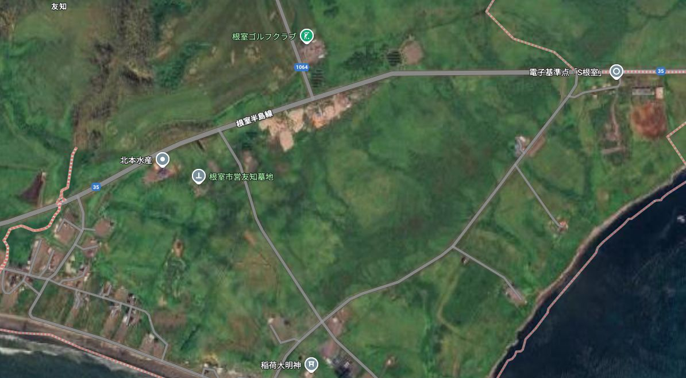
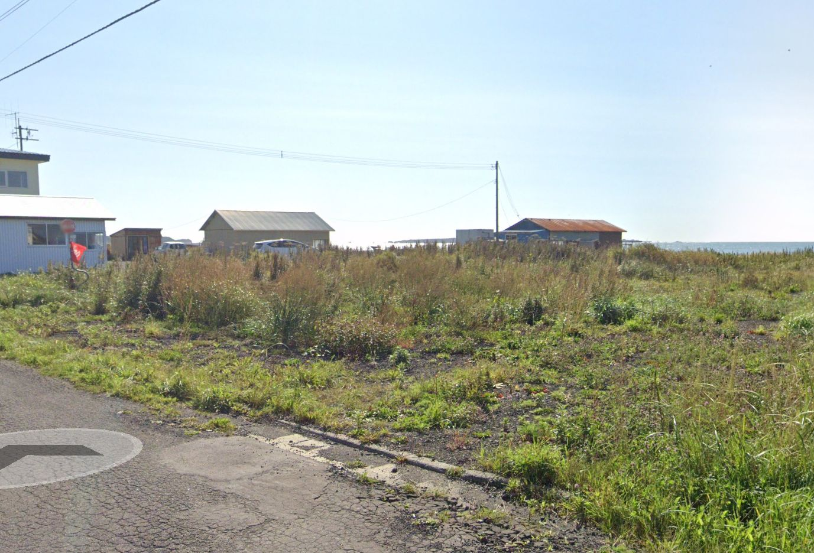
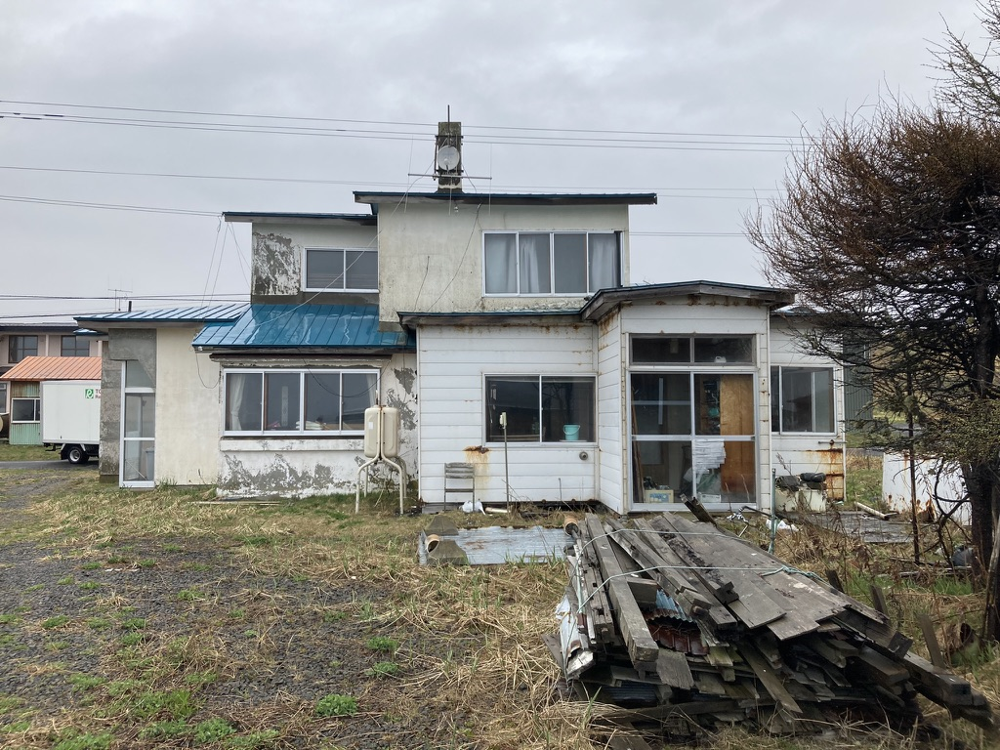
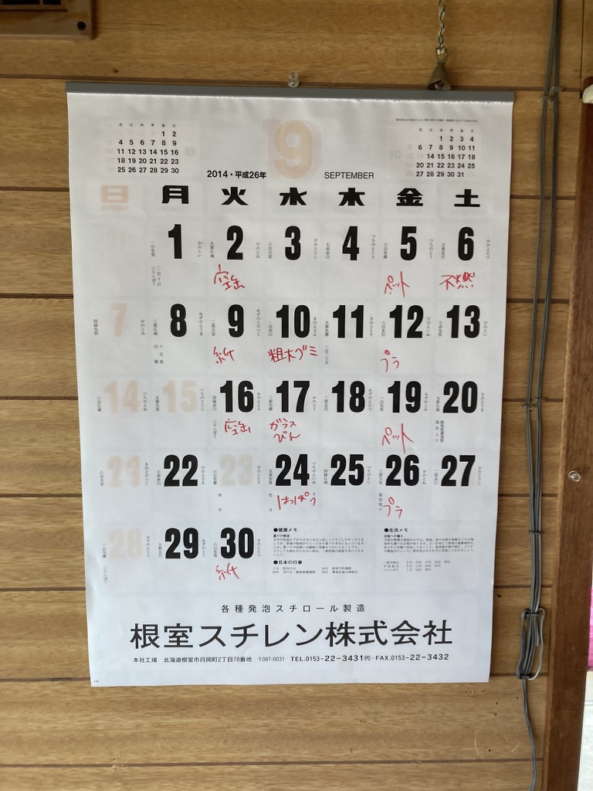
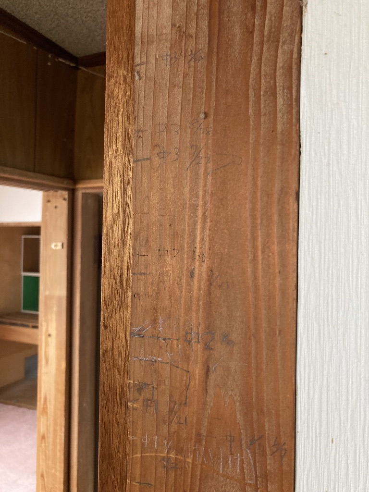
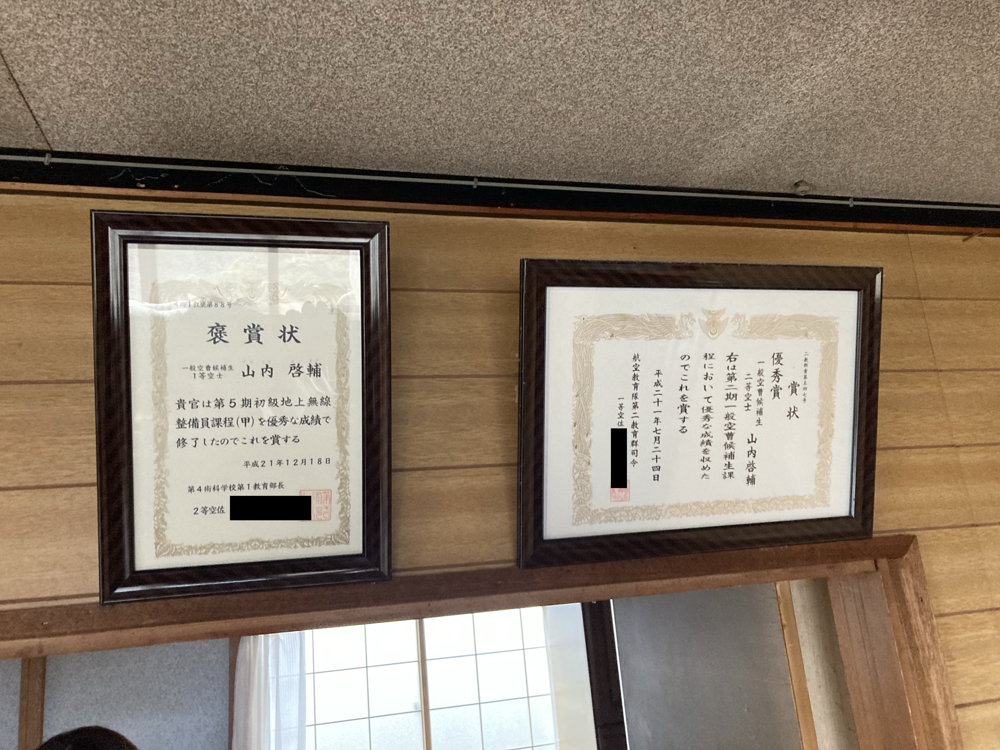
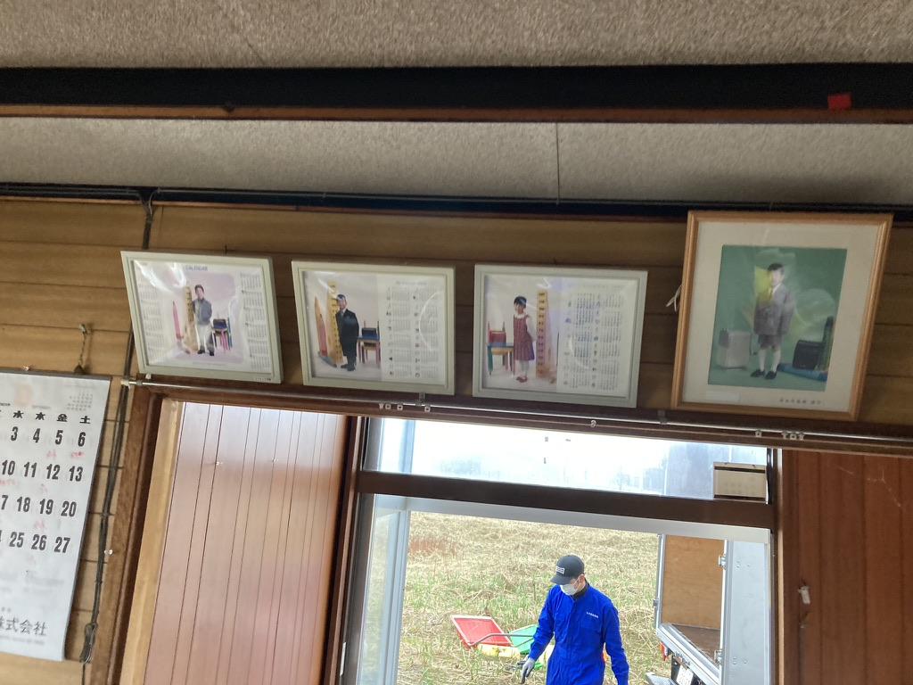
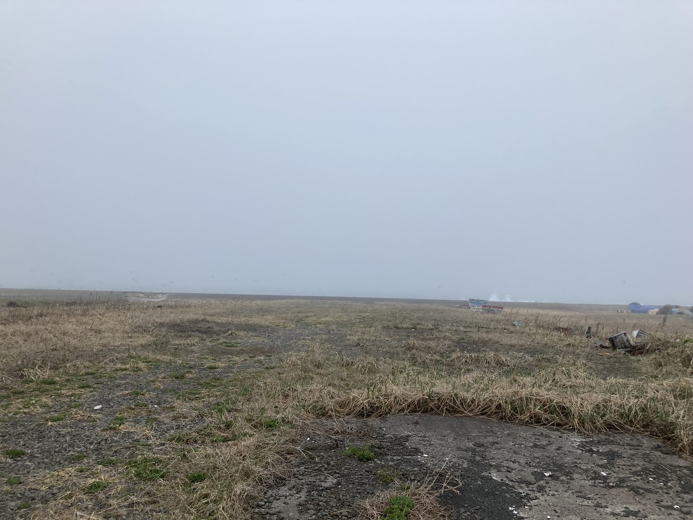

Not Newsのこちらのエピソードを聞いた  
https://listen.style/p/hpstgu2x/vuxf3fbv  
超ざっくり言うと、過去の通学路を歩いてみたら良かったということを言ってた

なんかすごいいいなーと思った  
個人的にもいつかやりたい

僕の場合は、実家はすでに取り壊してるし、唯一徒歩で通学していた小学校は廃校（建物は多分残ってる）になっていたりと、何だかエモ要素が満載である  
今思えば、通学路の途中で謎の工場？があったことも思い出した

このスクショ左下あたりから、右上の電子基準点「S根室」と言う謎の地点の右下あたりにある小学校まで通学していた

今は何もない、この中心あたりに実家が建っていた

よければ周辺を散歩してみてください笑  
https://maps.app.goo.gl/K5KHy6bn1MUjv2Av7

---

2022年のゴールデンウィークに実家取り壊し前の片つけを手伝いに帰った

すでに実家には誰も住んではおらず、元々古かった家が、さらに古びていた

家に入ると2014年で時が止まったカレンダーがあった  
2014年の9月に、この家は役目を終えたのだろう  
僕はすでに実家を出て、福岡で家族ができていたのでこの時のことはあまり詳しく覚えていない

色々懐かしいものもあった

実家あるあるな気がするが、壁に身長を記録したものがあったり

賞状が飾ってあったり

小学校に入学するときの写真が飾ってあったりと懐かしい気持ちになった

それから数ヶ月後に、取り壊しが行われた  
うちは父親が僕が高一のときに亡くなっており、母親は再婚していて、そのタイミングで実家が空き家になった背景がある  
実家の取り壊しには費用が発生するが、その費用は再婚相手が出してくれたらしい  
ありがたい

この写真は少し上に貼った古びた家を撮った位置から、180度振り返った方向の写真  
僕の生まれ育った町は漁師町なので海が目の前にあるし、船が捨てられている・・・笑  
この時は当時は感じていなかった磯臭さを感じたことを覚えている

なついなー

---

今日の読書とか勉強とか
- Distinction2000
- 勉強会の資料作成
