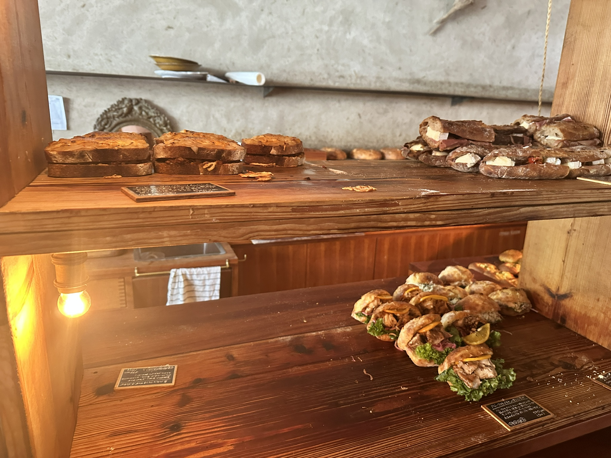
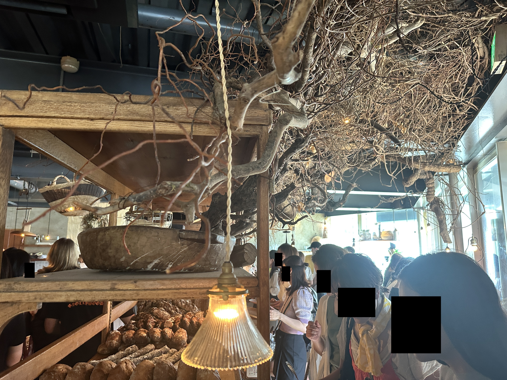
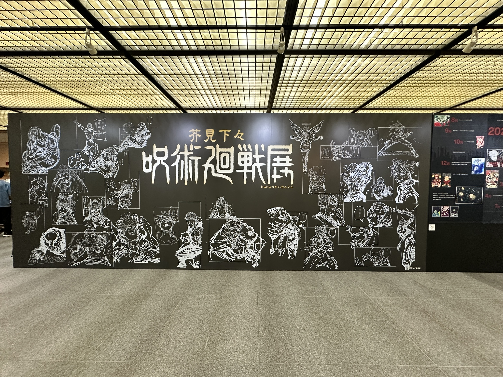
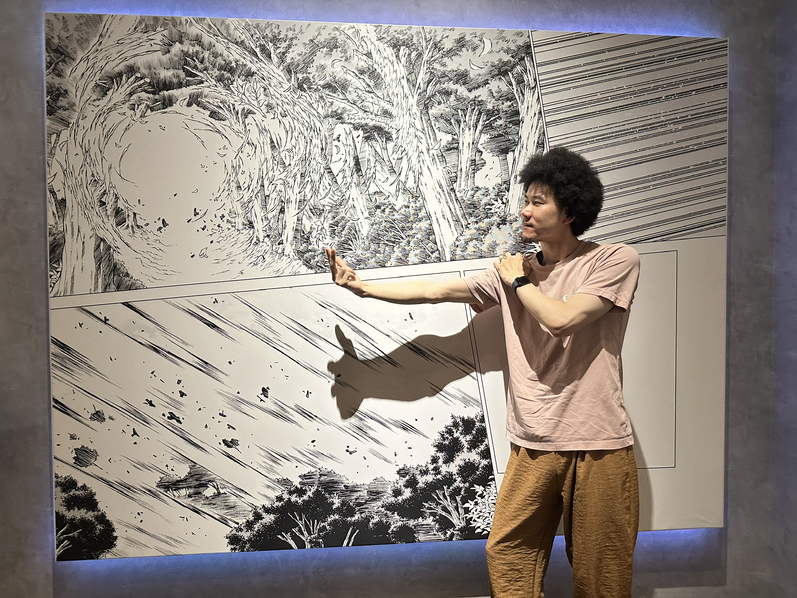
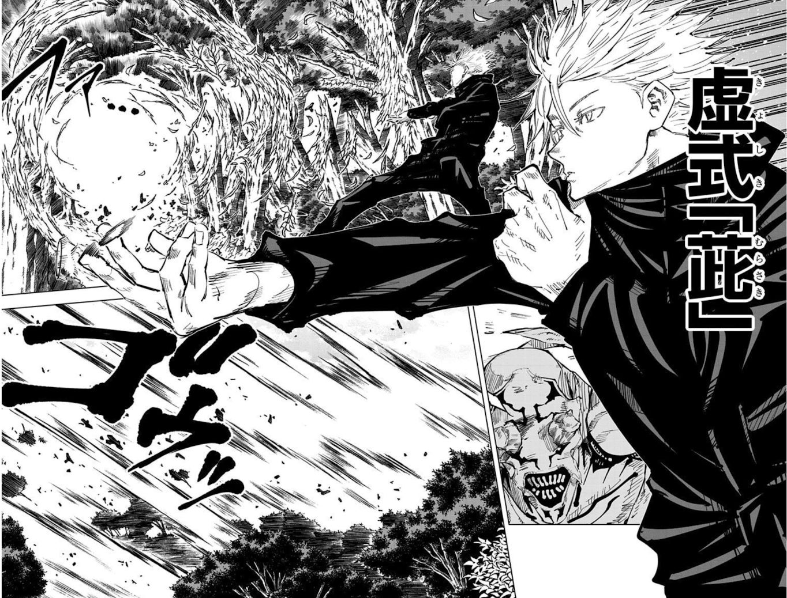
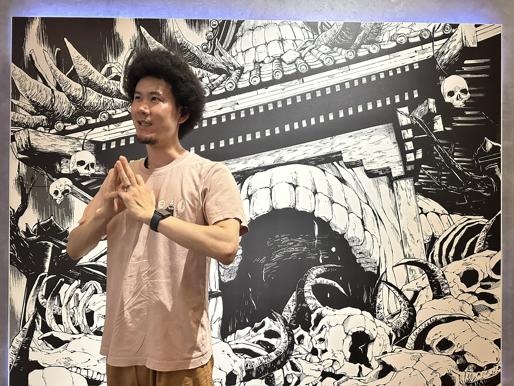
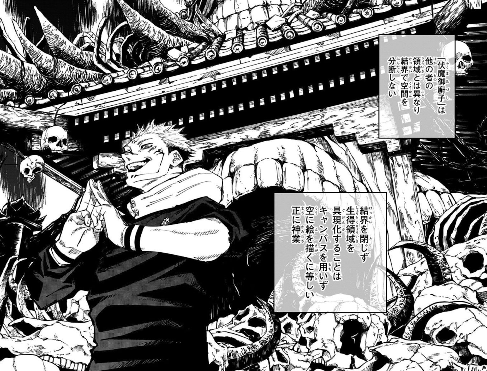

今日は妻と二人で[呪術廻戦展](https://jujutsuten.com/)に行ってきた

の、前に[パンストック 天神店](https://tabelog.com/fukuoka/A4001/A400103/40052317/)というパン屋さんに行ってきた  
朝の8時前にオープンするので、その10分くらい前に行ったけどすでに数十人並んでいた

おしゃれなパン屋さんだった  
この写真の右上に写ってるパンが美味しかった

カマンベールチーズやトマト、生ハムなどが挟まった  
誰が作ってもうまくなる組み合わせ

他の買ったパンの写真は撮り忘れたけど、こんな写真は撮った

「この上のワシャワシャした木、めっちゃ髪に引っかかるんですけど」と言う写真  
まじでアフロに引っかかってストレスだったが、ニッチな悩みすぎて改善はされないだろう

おしゃパン力の低い僕的には、朝から「あじぃ〜」って汗流しながら並ぶほどではなかったかもしれない  
美味しかったけどね

## 呪術廻戦展

（なんとなく見出し）  
昨日から始まった呪術廻戦展に行ってきた  
呪術廻戦展、めちゃ言いづらい

非常に良かった  
10時前くらいに入って、13時前くらいに出てきた  
情報量多すぎて、本気出したらあと1時間くらいは入れた気がする

グッズも欲しいのが多すぎて、グッと欲を抑えたにも関わらず7,000円くらい買ってしまった  
グッと抑えたにも関わらず、、、

基本的にランダムで当たる仕組みが多く（全XX種/ランダム1種類入り、みたいなの）、狙いのものは一つも当たらなかったが、「うわー、こいつはいらんぞ、、、」と言うのも一つもなかったのがせめてもの救い

そういえば、会場内で五条先生ごっこができた

こちらが本家

> 引用：呪術廻戦6巻52話

サイズ感の違いはしょうがないとして、もうちょいクールな表情が正解だった

宿儺ごっこもできた（なんか合成っぽい？）

こっちの本家はこれ

> 引用：呪術廻戦14巻118話

宿儺くらいいい感じに笑ってたつもりだったんが、足りなかった

楽しかった！

---

今日の読書とか勉強とか
- ８６―エイティシックス―Ep.4 ―アンダー・プレッシャー―
- カンバン仕事術
- Distinction2000
