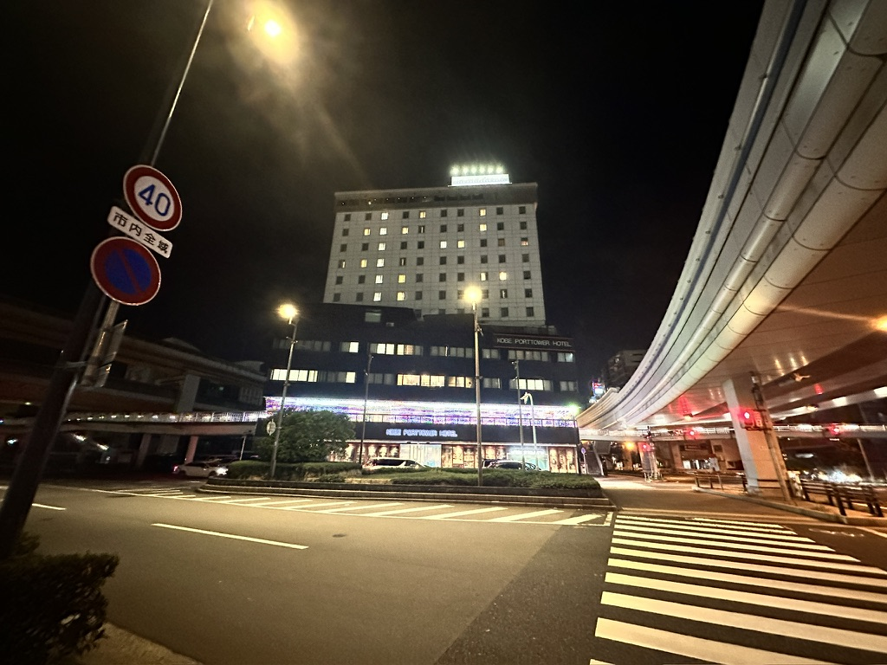
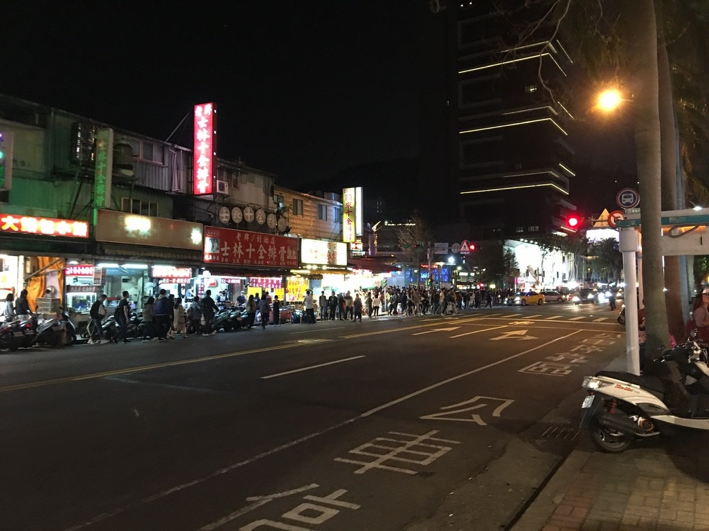
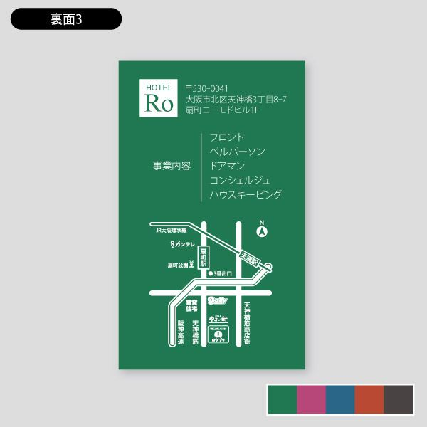
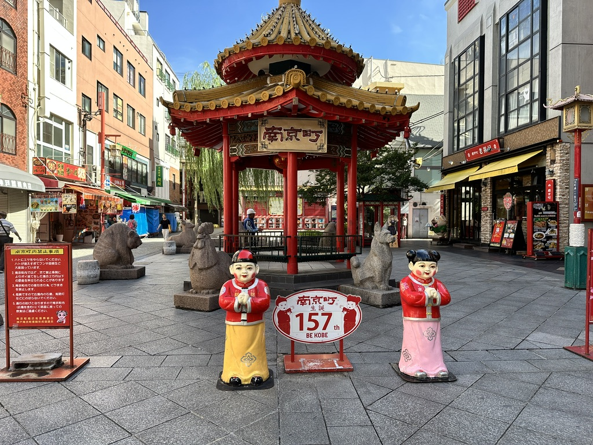
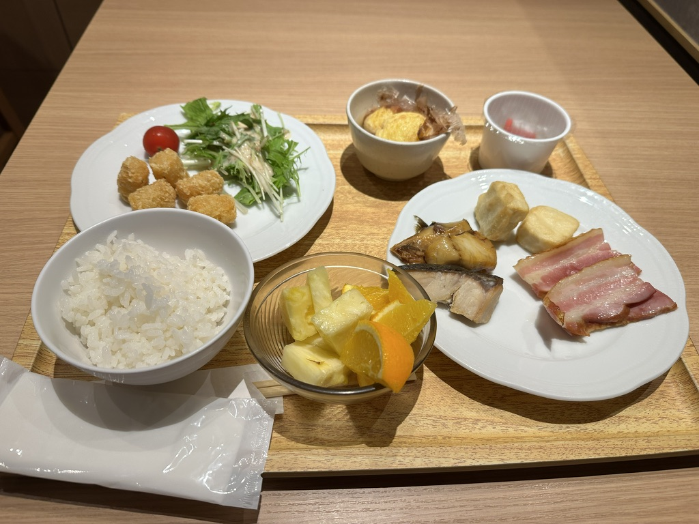
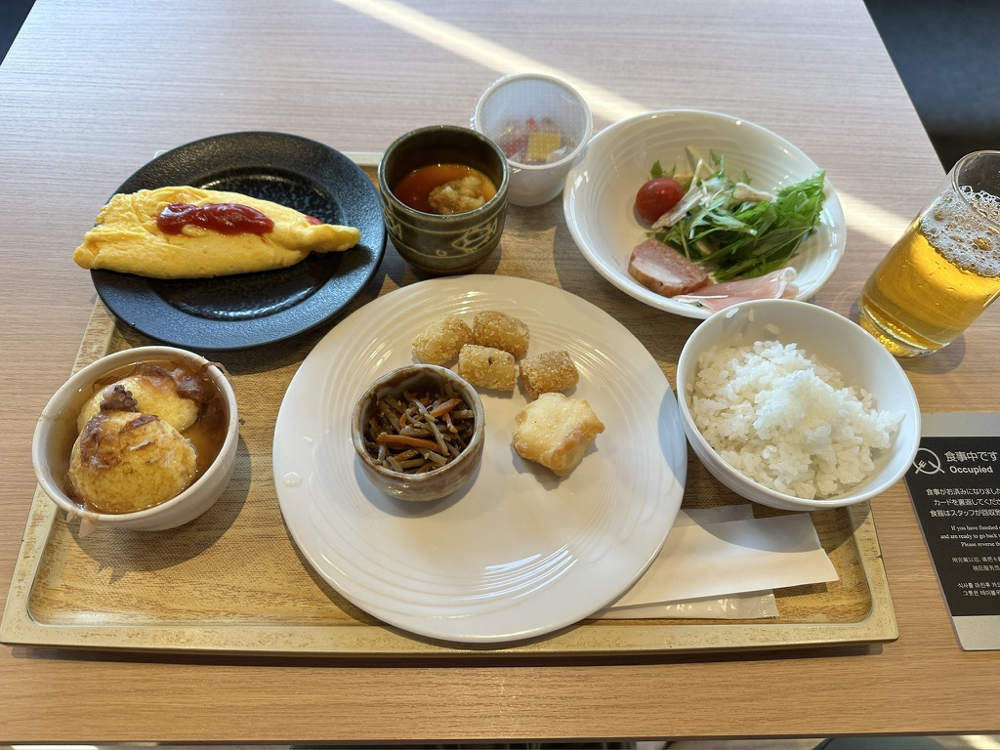
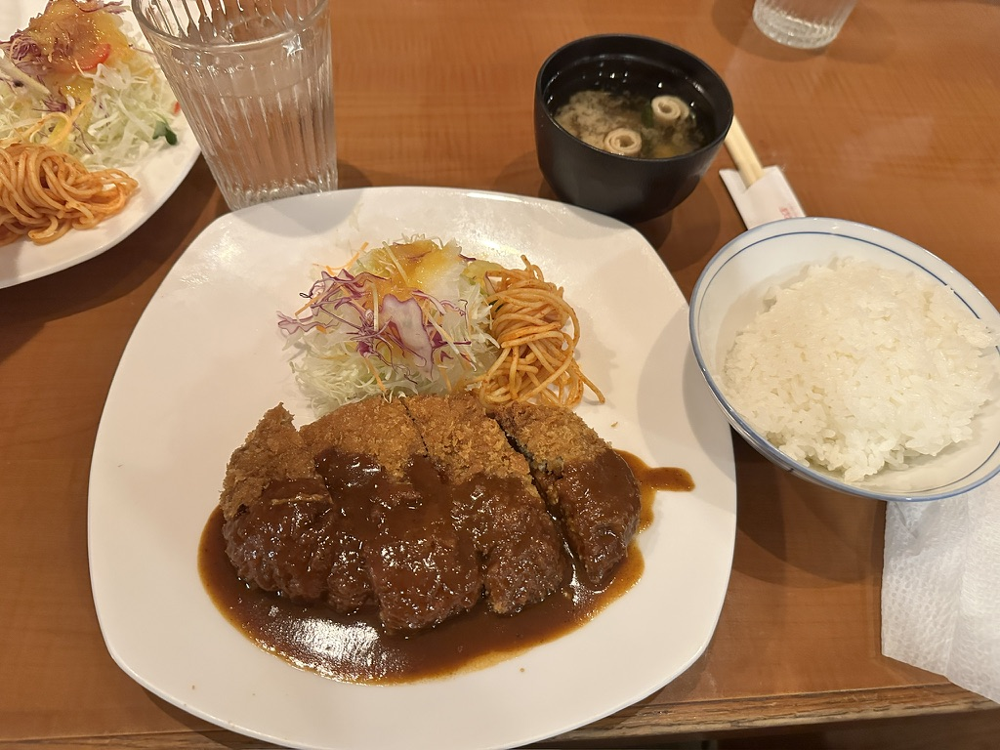

7/16-18の2泊3日で神戸出張だった  
出張の内容は仕事の内容なので特段話すこともないけど、他の部分を少々

## 知らない街を歩くのが好き
僕は知らない街を歩くのが結構好き  
なので、他のみんながオフィスそばのホテルをとる中、徒歩20分くらいのホテルをとった  
神戸に行くのは初めてだったので、歩く機会を無理やり作った

[神戸ポートタワーホテル](https://www.kobe-porttower-hotel.com/)と言うところに泊まった

### 台湾で知らない街を歩こうと思って歩いたら迷子になった
昔、不動産会社に勤めていたときに社員旅行で台湾に行ったことがある  
そのときは台北のホテルに泊まった  
夜はフリータイムで時間があったので、台北の街を散策した

海外旅行用のsimを契約したりはしなかったので、スマホで地図などは見れない状況で散策をし始めた  
僕の自己認識としては、方向音痴とは真逆の存在でどんなにプラプラ歩いてもホテルに帰れる能力を持っているので、かなりテキトーに歩き回っていた

あまり台湾っぽい写真がなかったので、一枚だけペタリ

非常に楽しい散策だった  
ただ、見出しにも書いた通り迷子になった。。。笑  
さて帰るかー、と思いホテルの方向に向けて歩き出して、ここを曲がったらホテルがあるはず、と思ったところにホテルがなかった

そこそこ焦った  
幸いなことに、ホテルからもらった名刺サイズの案内があって、そこの裏に簡易地図が載ってあった

> 引用：ロケットプリント [ホテルシルエット・ベッドのシルエット | デザイン名刺](https://rocketprint.jp/catalogs/design_businesscard/detail_design_businesscard?nu=1020)

イメージとしては、こんな感じのやつ

その地図に近くの交差点名が書いてあったので、それを探すことにした  
思った場所ではなかったものの、そう遠くはないはずだろうと言うことで近辺を探して無事に地図に載っている交差点名を発見した

全然、神戸出張と関係ないけど思い出した話

### 神戸をプラプラ
ホテルからオフィスに行くときや、ホテルに帰るときは毎回ルートを変えてプラプラと散歩をした  
神戸は中華街？が有名らしく、そこも通ってみた

帰りの新幹線も、少し時間があったので三宮から新神戸まで歩いて移動した  
さすがに30分程度歩くと、中に来ていた肌着がビチョビチョになってしまったわけだが、、、

## ご飯も美味しかった
あまり写真は撮れてないけど、

ホテルの朝食バイキングその1（1泊目）  
上に汚く鰹節が垂れ下がっているのは明石焼きなんだけど、美味しかった  
パイナップルは思ったよりも酸っぱかった

ホテルの朝食バイキングその2（2泊目）  
明石焼きが美味しかったので、3個から5個に増やした  
オムレツも食べた

帰る直前に[洋食屋ロイン](https://loin-kobe.com/roinlist/loin01)で食べたミンチカツ定食  
美味しかった  
他と比べてここが〜、とかはあんまなかったけど間違いなく美味しかった

## 神戸の人の特徴
神戸に行って思ったことがある  
歩行者がめっちゃ赤信号でも渡ってる  
少なくとも福岡の数倍そういう人がいる

別にそれの良し悪しを言いたいわけではなく、多くて印象に残ってるという話

ただ、みんながみんな見境なしに渡るわけではなく、誰かが渡るとそれに続いてほとんどの人が渡るような感じだった  
日本人だなー、と思った

## 景色を眺めたかった
朝ごはんを食べながら、外をの景色を眺めていた  
それを楽しみながら食べていた  
隣に座った人が窓際に座って、眩しかったのか暑かったのかわからないけど、ロールスクリーンを下げてしまった

はあ、、、じゃあそこ座んなよー、、、  
残念だった

---

今日の読書とか勉強とか
- ８６―エイティシックス―Ep.4 ―アンダー・プレッシャー―
