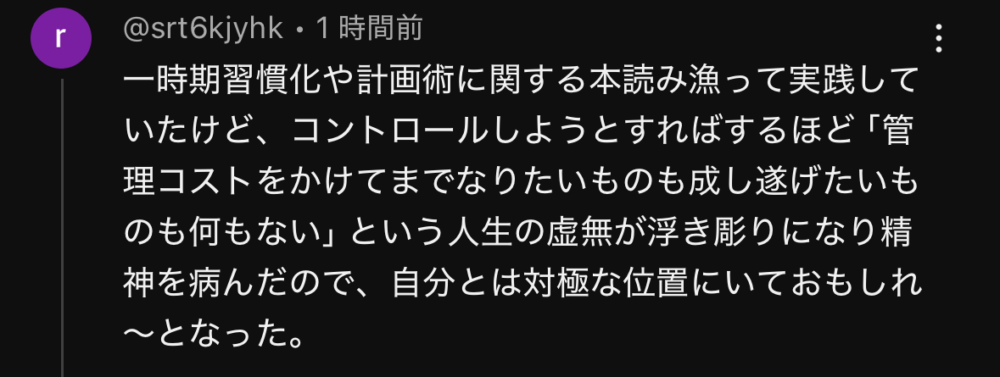

import { YouTube } from 'astro-embed';

好き語りというYouTubeチャンネルを好きで見てる  
今日は自己管理について語っている方がゲストとして出ていた

<YouTube id="ypPAeRlpYds" playlabel="Play" />

ざっくり内容を話すと、
- 予定を細かく管理する
- ちゃんとバッファを持つ（予定ごと、日ごと、週ごとにバッファがある）
- 定期的に予定を見直す（目標と自分の現状をもとに）  

みたいなことを言っていた

一時期、僕も予定を管理していたことがあるけど、確かに捗ったのを覚えている  
途中からしなくなっちゃったけど、またやってみようと思った

まずは軽くやってみるのと、飽きたらやめる  
という形でやってみよう

動画にこんなコメントがついていた

確かにこの意見もそうだなーと思った  
まあ、とりあえずやってみよ

---

今日の読書とか勉強とか
- Distinction2000
- 調剤報酬事務＜よくある疑問＞がすっきりわかる本
