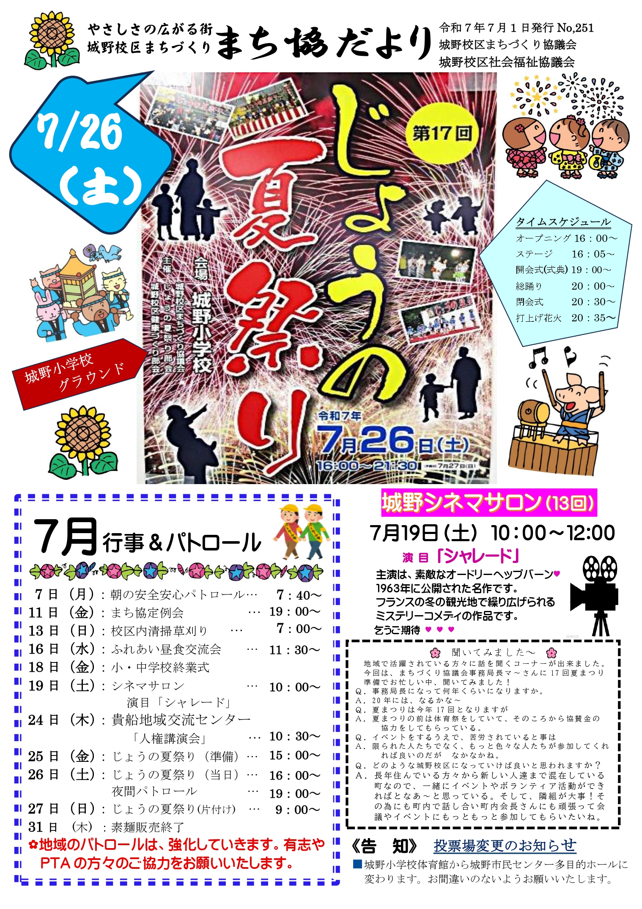

## じょうの夏祭り
じょうの夏祭りに行ってきた

なんか食べるぞー、と思って行ったがフランクフルトしかなかった  
しゃーなしにフランクフルトの列に並んだが、僕の少し前で売り切れた涙  
まあ、行くの遅かったからね・・・

花火は綺麗だった

なんかこういうの、写真でよくみる気がする（気のせいかもしれない）っていう写真が撮れた

さて、これの緑の光はなんでしょう？

正解は、これ

じょうの夏祭りの花火の最後は、毎年これを飛ばしてる  
結構子どもたちが喜んで拾ってて、すごく良い

毎年これがくるのを忘れているので、「あ、そうだった！」と毎回思ってる  
全然必要ないんだけど、なんかついつい拾っちゃう

## 妻の自転車を新調した

妻の自転車がパンクした  
パンクの修理も7,000円くらいするようで、タイヤの状態的には後輪もそのうちするかもしれないという話だった（今回は前輪がパンク）  
そこそこ乗ってるの自転車だったんので、じゃあ買い換えるかーということになった

変速ギアのない安いママチャリでも20,000円くらいで、自転車も高くなったなーという気がする  
数年前は1万円ちょいだった気がするんだけどなぁ

お店には中古の自転車も置いていて、十分良さそうな中古の自転車にした  
13,000円くらいで変速ギアもついていて、そこまで古い印象もない自転車だったので良い買い物だった気がする  
妻は、乗り心地も良く喜んでいたので良かった

---

今日の読書とか勉強とか
- 機動戦士ガンダム THE ORIGIN (5)
- Distinction2000
