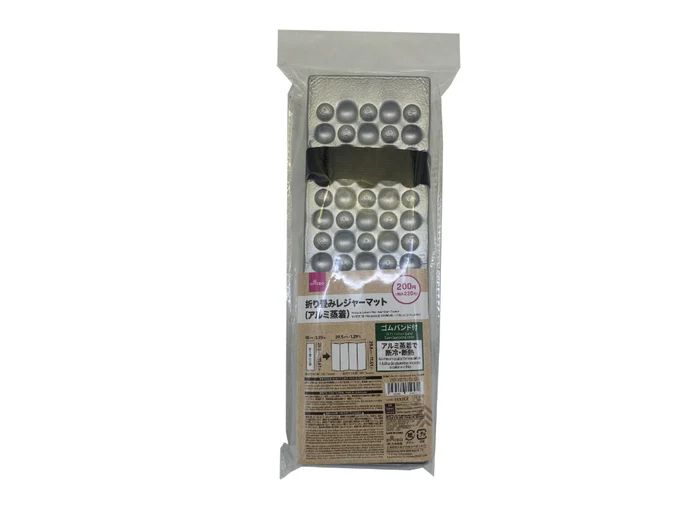
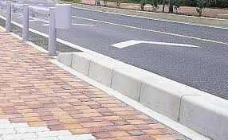

花火を見に行った  
関門海峡花火大会

ここらじゃ大きめで人気のある花火大会で、人も多いので行ったことがなかった  
人気なだけあって迫力満点で良い花火だった

ただ、帰りの電車待ちの列に並ぶのとかが嫌すぎて、もう行かないかもしれない

花火に行くにあたってダイソーで「[折り畳みレジャーマット（アルミ蒸着）](https://jp.daisonet.com/products/4550480614571)」を買ったが、非常にコスパの良い商品だった  
今日も買ったものを食べるために路上に敷いて使ったけど、買ってよかったと思えるものだった

コスパ観点では非常におすすめ

---

花火のとき歩道と道路の間にある、少し高くなってる部分（画像のやつ）に人がたくさん座ってて、そのうちの一人である男の人の前を通ろうとして、女性二人が「すいませーん」と言いながら横切ろうとしたら、「ここは通路じゃありません。私が座っている場所です」とか言ってた・・・  
座る場所でもないが・・・

どういう気持ちで言ってるんだろ・・・

---

今日の読書とか勉強とか
- ない
