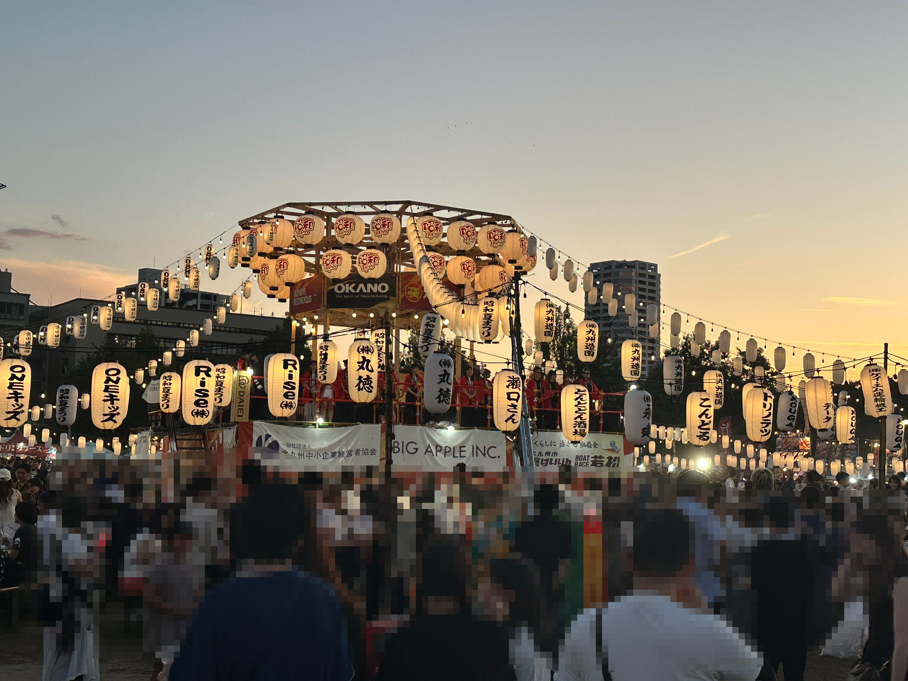

今日、[北九州昭和夏まつり](https://www.shouwasummerfes.com/https://www.shouwasummerfes.com/)に行った

初めて行った（というか初めて知った）けど、かなり人が多かった  
写真のやぐら？の周りに人が集まって、昭和の歌謡曲に合わせて踊っていた  
普段は踊ってないであろう人たちが集まって踊っているのを見ると、人って音楽に合わせて踊るのが好きなんだなーと思う  
狩猟してた人たちも歌って踊ってたイメージあるしね

---

今日もプールに行った  
水着を新調したが、なんか絶妙にダサかった

まあー、しゃーなし

浮き輪も新調したんだけど、なんか穴が空いているのか徐々に萎む・・・  
悲しい

---

今日、Amazonに2件もクレームを入れるというクレーマーっぷりを発揮した

1件目は、昨晩時点で今日の午前中に届くというから買った商品が、いつの間にか明日到着予定になっていた  
「え？これ明日届くの？」というクレームを入れた  
結局は夕方届いた

2件目は、新調した浮き輪を交換して欲しかったが、（交換できそうな書き方なのに）返品しかメニューに出てこなくて、「交換して欲しいんだけど」というクレーム？を入れた  
コッチは返金（返品不要）するから買い直してくれ、ってなった

---

ちなみに浮き輪は全然穴の位置がわからなかった  
時間を置いてから、「あー、どこだろうなー」と何気なく浮き輪にうつ伏せ状態で乗ったら、ちょうど顔の部分から風を感じて、穴あきポイントを発見した  
とりあえず応急処理用のシールを貼った（同封されていた）ので、一旦はこのまま使ってみよう

発見できてよかった

---

今日の読書とか勉強とか
- 今日は色々あって何もなし
